# Meu Portifoli
Olá seja muito bem vindo.

Desenvolvi esse projeto utilizando o react.js e algumas outras ferramentas. Minha proposta foi criar um projeto simples com designer minimalista que vai direto ao ponto apresentando meu pontos fortes e principais projetos.

No decorrer desse README.md eu vou apresentar todas as seções do meu site, como eu construi elas, quais foram os desafios e o que eu aprendi durante o desenvolvimento desse projeto. este não foi meu primeiro portfolio, porém, é o meu primeiro "grande" projeto feito quase que 100% com react.

## Cabeçalho

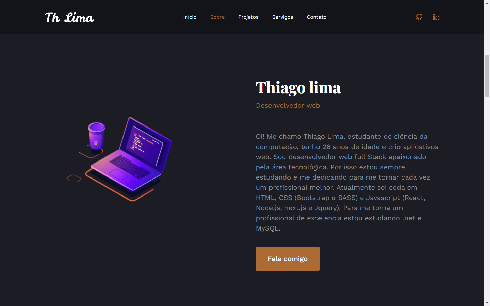
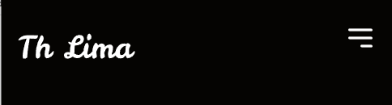
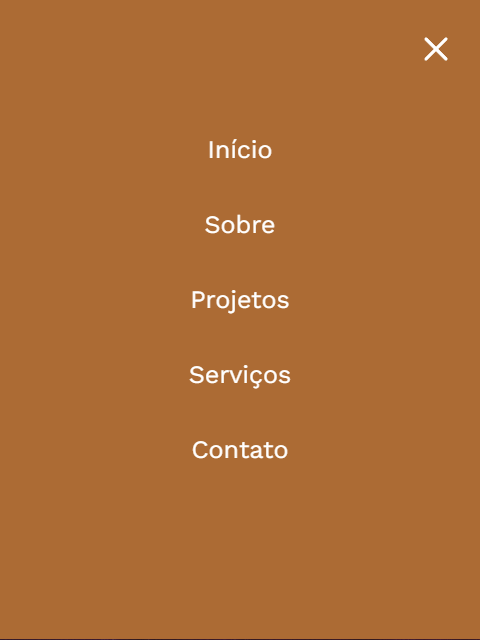

O cabeçario esta dividido em 3 elementos logo, navbar, rede social. meu layout ficou bem responsivo e como disse antes esta no estilo minimalista. Ele carrega, na minha opnião, os principais elementos de um portfolio que é o linkedin e o repositorio no github.

a maior parte dos elemento do cabeçario assim como boa parte do app foi criada com um "API" que no cado é o arquivo data.js. eu chamo o arquivo e uso o .map(() =>{}) para puxar o que eu preciso imprimir na tela. 

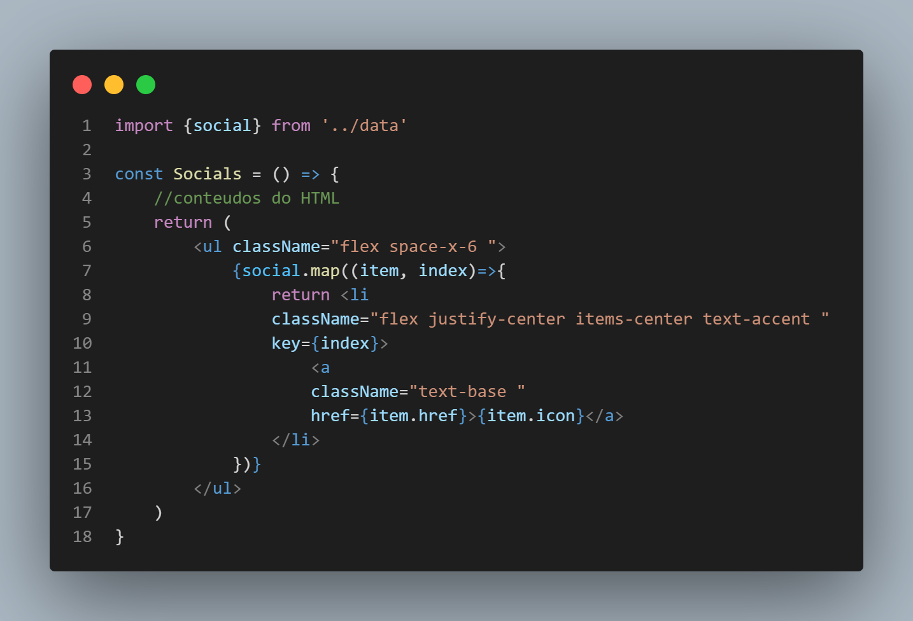

## inicio 

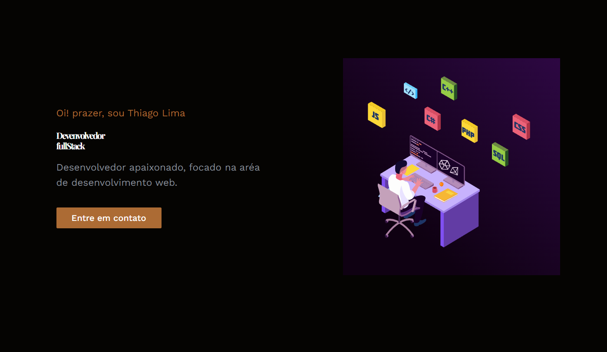

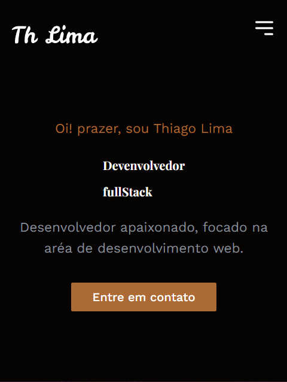

Minha home é feito no estilo landing page bem simples e basica. não tenho nada de novo para falar nessa parte.

## sobre

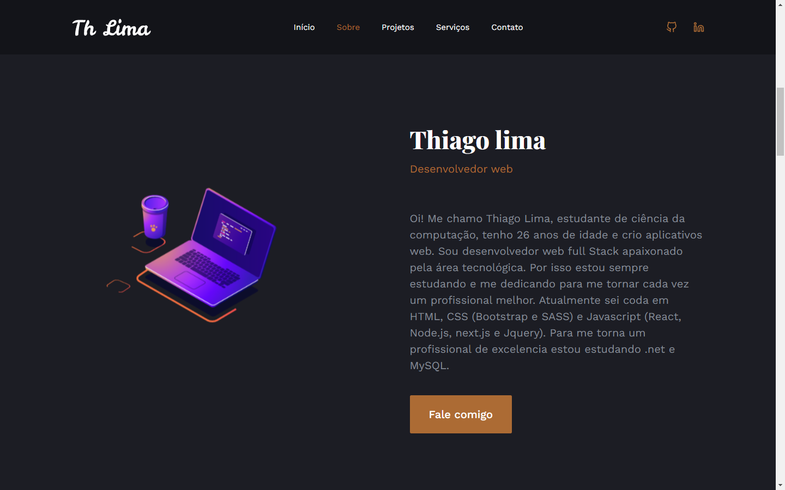

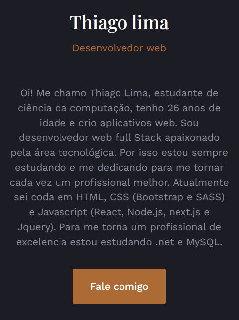

## projetos

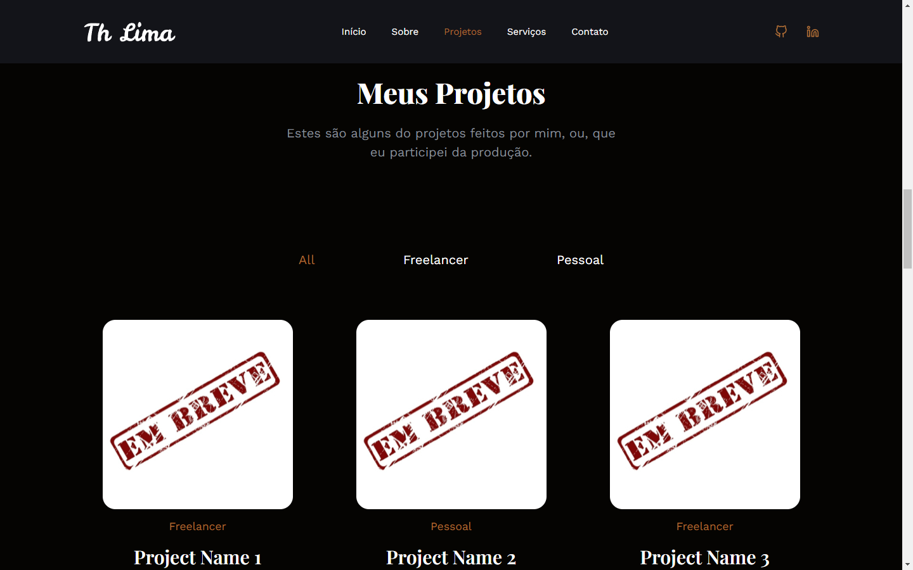
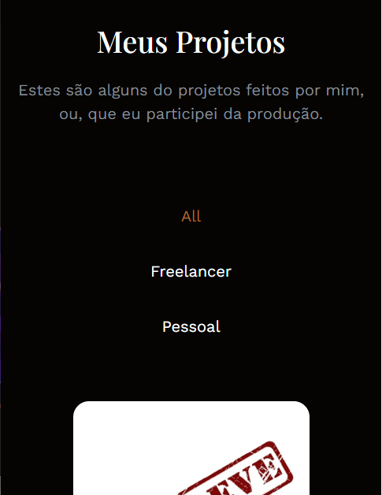
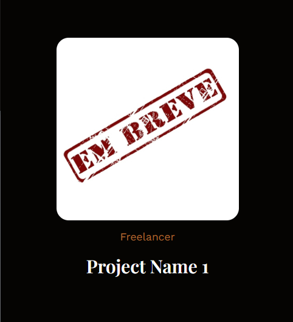
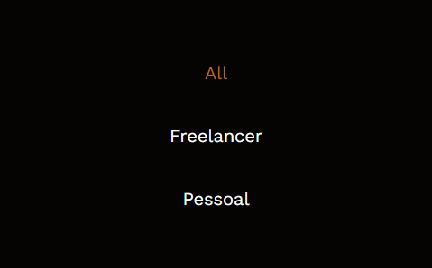

Nessa seção tem algo interessante que é o seletor dos projetos. quando eu fiz o portifolio ainda não tinha projetos para apresentar por isso deixei só o embreve. 

Foi um desafio para mim criar esses cards de forma dinamica e ainda fazer a seleção deles mas com muito esforço eu consegui vou deixa o codigo aqui e um simples explicação

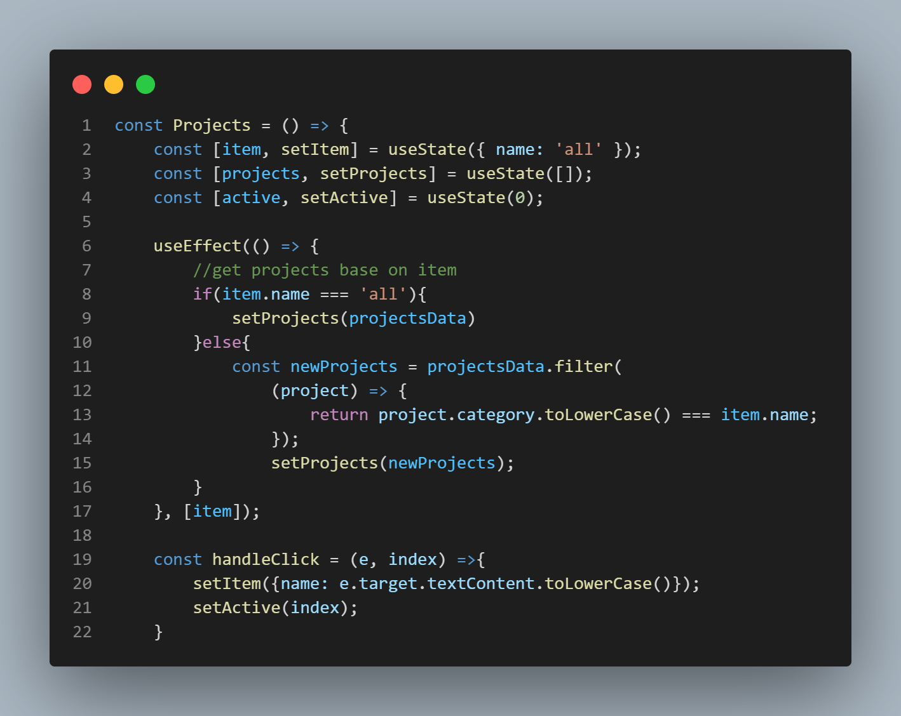
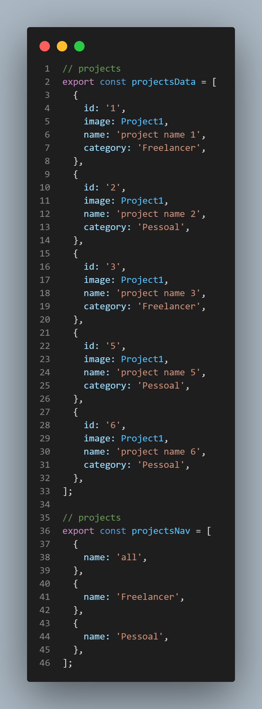

A função é simples o setItem fica esperando o sinal do 'all' e o setProjects esquera receber o nome do item que foi clicado. quando o card é criado as informações da categoria dele deve ser iguals as da nav pois é atravez dessa comparação que eu altero o que vai ser criado. 

## serviços 

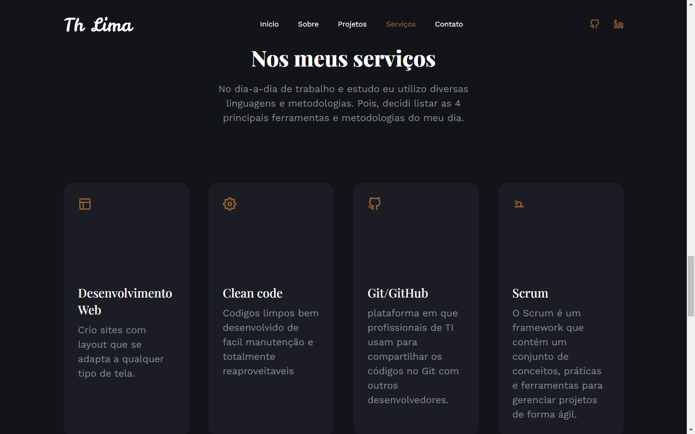
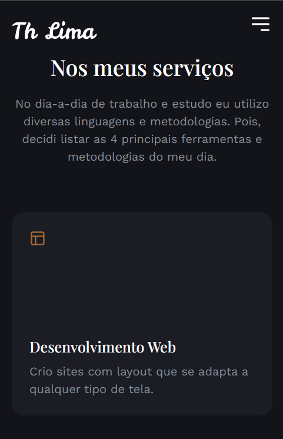

## skills 

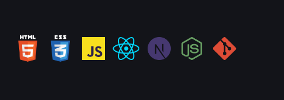

## contatos

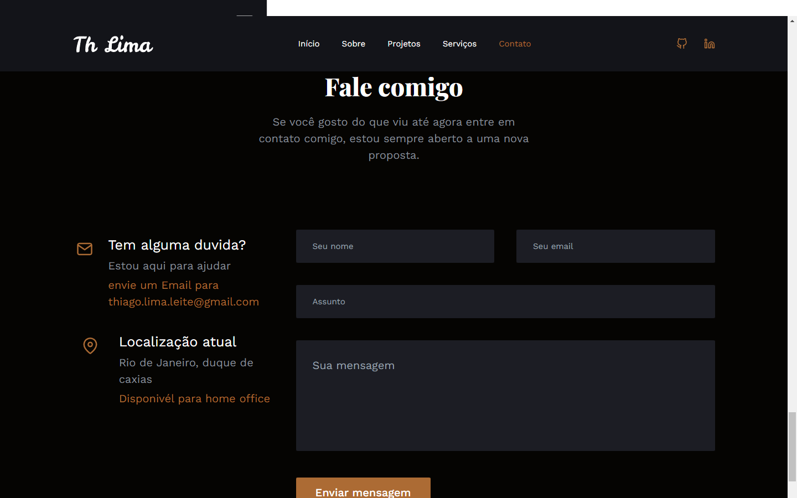
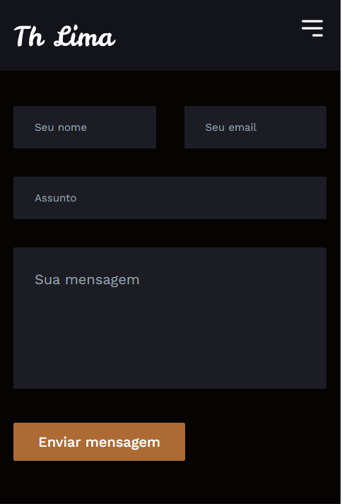

a parte de contatos é simples como todo o app mas quero deixa aqui outra coisa que me fez evoluir. 

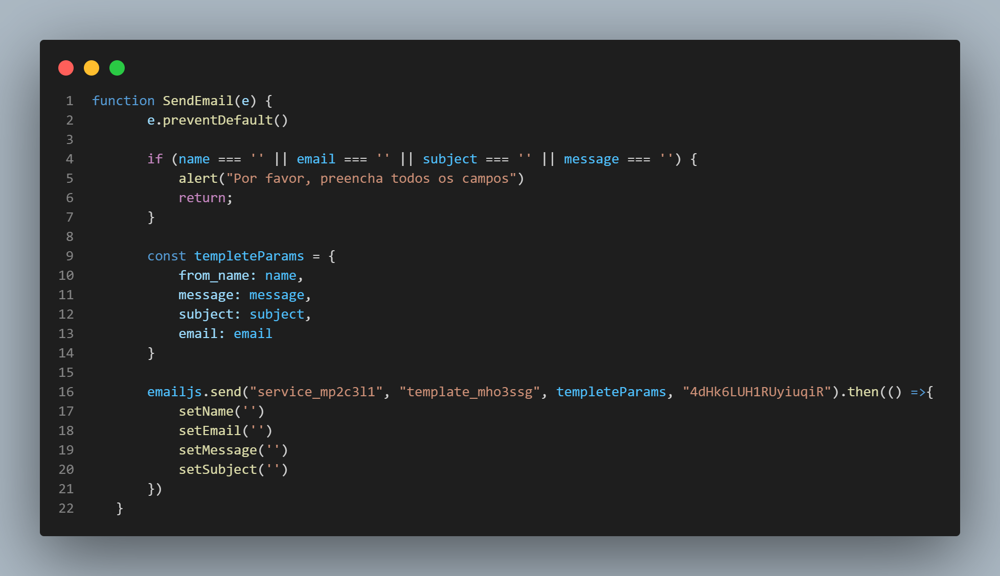

sei que essa função não tem muitas condicionais e que é facil a pessoa frauda os dados mas preferi so ter o retorno de se os campos foram preenchidos. eu utilizai o emailJS e achei ele incrivel instalei ele com o npm, importei ele e chamei a função dele como .send para não precisar transforma minha função em um async eu optei por colocar so um .then mesmo. não fiz os tratamentos de erro pq a aplicação é pequena. optei por so apagar os campos após o envio ser confirmado. Futuramente eu pretendo coloca um aviso visual na tela confirmando o envio, algo como um alert("mensagem enviada com sucesso")